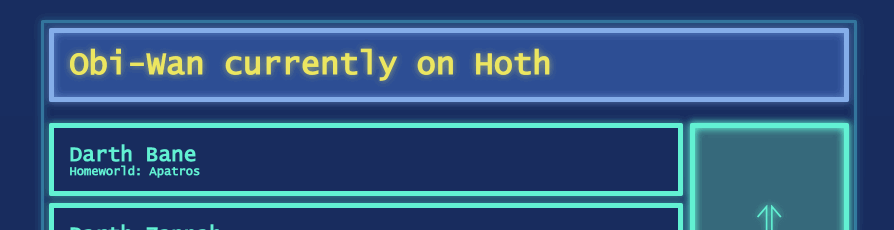
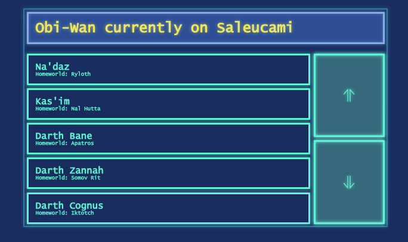
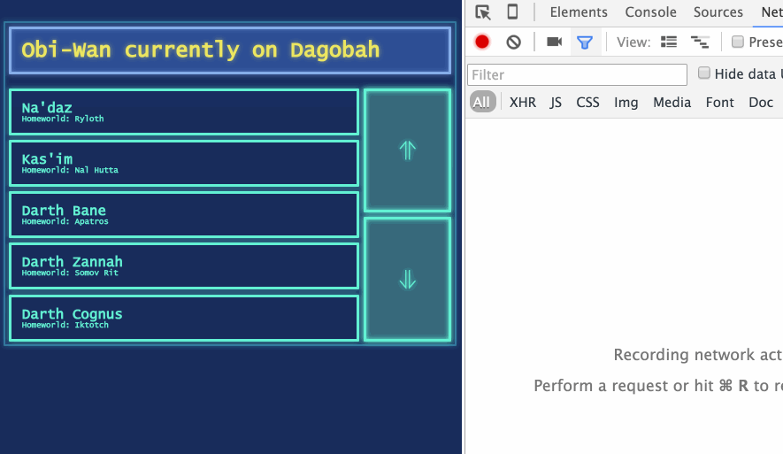
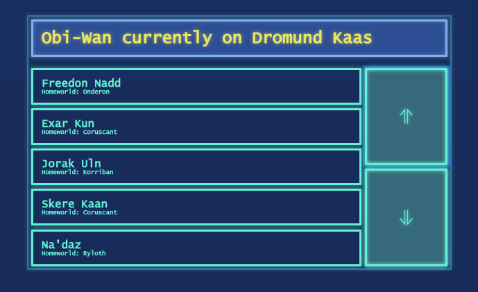
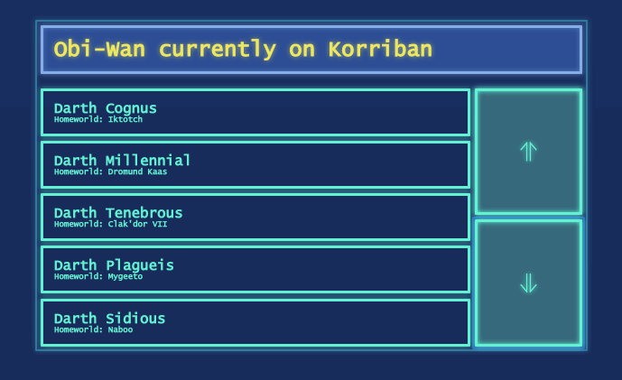

# Осваиваем Flux

## База данных темных лордов

### Легенда

Вы помощник Оби-Вана кеноби и ваша задача создать интерфейс пользователя к базе данных ситхов. Оби Ван путешествует по галактике посмещая множество миров. Говорят, что в каждом мире где родился Тёмный Лорд можно найти некую "печать". Оби-Ван собирается проверить, правда ли это.

Оби-Ван дал Вам задание создать интерфейс пользователя, показывающий  список Темных лордов, упорядоченный по отношению "учитель - ученик" (таким образом темный джедай в строке `N` является учителем темного джедая в строке `N+1`
Интерфейс также показывает планету на которой Оби-Ван находится в данный момент и подсвечивает красным, если один из джедаев, отображенных на экране родился на этой планете

### Требования

- Информация о текущей планете поступает через WebSocket по адресу `ws://jedi.smartjs.academy` и отображается наверху страницы



- Для получения списка темных лордов существует URL `http://jedi.smartjs.academy/dark-jedis/`. Первый запрос должен быть отправлен для получения Darth Sidious: `http://jedi.smartjs.academy/dark-jedis/3616`
    * HTTP ответ для каждого джедай содержит URL его  ученика `response.apprentice.url` и учителя `response.master.url`.

- Кнопочки скролла: вверх/вниз, сдвигает лист на 2 позиции

- Когда список проскроллился, загружайте дополнительные строки **по одной** для заполнения пустых мест. **Не кешируйте** данные (другие пользователи могут вносить правки, а нам нужны самие свежие данные)



- Никогда не делайте запрос для элемента, который находится сейчас за пределами списка. Отменяйте подобные "устаревшие" запросы, если пользователь быстро скроллит туда-обратно



- Когда изменяется либо планета, на которой находится Оби-Ван, либо мы проскроллили список, проверить - существует ли в списке Темный Лорд, чья планета соответствует текущей планете. Если это так - отобразить этого Темного Лорда красным, и ОТМЕНИТЬ все выполняющиеся на данный момент HTTP запросы. Запретить scrolling до тех пор пока Оби-Ван не прыгнет на другую планету.



- Список нельзя проскроллить вниз, если последний ситх в списке не имеет ученика. Список нельзя проскроллить вверх, если первый ситх в списке не имеет учителя. Используйте класс  `.css-button-disabled` на кнопках для отображения этого статуса



- Используйте CSS классы из  `styles.css` для HTML, который может выглядеть приблизительно так:
```html
<div class="app-container">
  <div class="css-root">
    <h1 class="css-planet-monitor">Obi-Wan currently on Tatooine</h1>

    <section class="css-scrollable-list">
      <ul class="css-slots">
        <li class="css-slot">
          <h3>Jorak Uln</h3>
          <h6>Homeworld: Korriban</h6>
        </li>
        <li class="css-slot">
          <h3>Skere Kaan</h3>
          <h6>Homeworld: Coruscant</h6>
        </li>
        <li class="css-slot">
          <h3>Na'daz</h3>
          <h6>Homeworld: Ryloth</h6>
        </li>
        <li class="css-slot">
          <h3>Kas'im</h3>
          <h6>Homeworld: Nal Hutta</h6>
        </li>
        <li class="css-slot">
          <h3>Darth Bane</h3>
          <h6>Homeworld: Apatros</h6>
        </li>
      </ul>

      <div class="css-scroll-buttons">
        <button class="css-button-up"></button>
        <button class="css-button-down"></button>
      </div>
    </section>
  </div>
</div>
```

### Выполнение и сдача задания

Никакого шаблона нет. Вам необходимо создать все приложение с нуля. Обязательные требования:
* React 0.14
* Redux
* Webpack
* Webpack-dev-server
* https://github.com/erikras/ducks-modular-redux

Создайте git-репозиторий так, чтобы я мог видеть ваш прогресс по решению этого задания на регулярной основе
